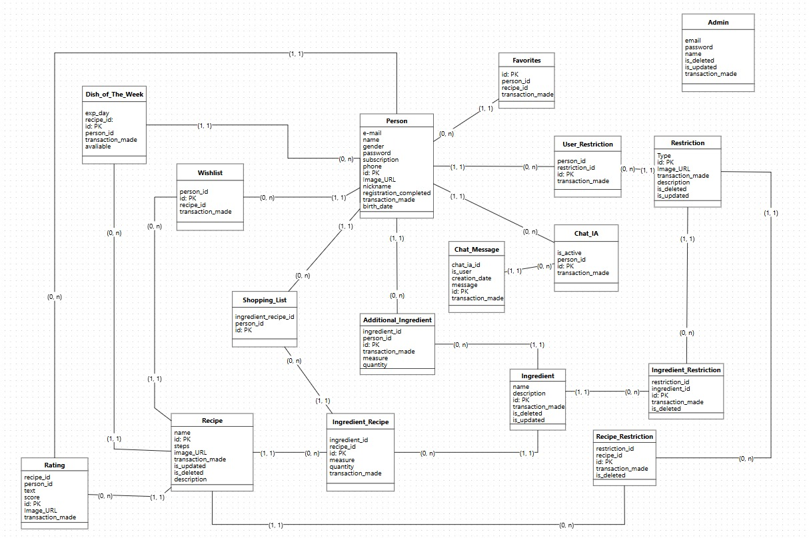
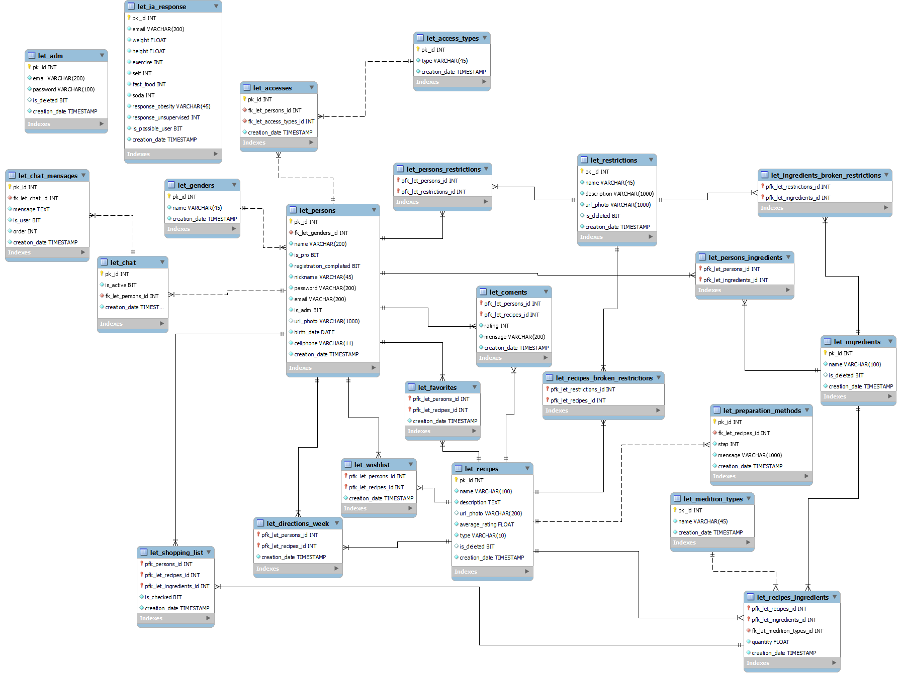

# Let's Snack - RPAs

Este projeto visa automatizar a atualização de dados cadastrais entre o banco de origem e o banco de dados normalizado e o MongoDB do aplicativo Let's Snack, assegurando que todas as informações estejam sincronizadas corretamente.

## Funcionalidades

- Atualizar os dados cadastrais do banco origem para o banco de dados normalizado da 2° Série;
- Atualizar os dados cadastrais do banco origem para o banco de dados MongoDB do APP Let's Snack;

## Modelagens

A seguir, são apresentadas as modelagens utilizadas para os bancos de dados SQL no primeiro e segundo ano

### Modelagem SQL Primeiro Ano



### Modelagem SQL Segundo Ano



### Modelagem NoSQL Segundo Ano


## Tabelas contempladas

A seguir, estão as tabelas que tiveram os dados transferidos do Banco Origem -> Banco Destino:

- Recipe - let_recipes e let_preparation_methods
- Ingredient - let_ingredients
- Restriction - let_restrictions
- Admin - let_adm
- Ingredient_Recipe - let_recipes_ingredients e let_medition_types
- Recipe_restriction - let_recipes_broken_restrictions
- ingredient_restriction - let_ingredients_broken_restrictions

## Normalização

Para as tabelas origem que se transformaram em duas tabelas no destino, foi aplicado o conceito de normalização:

### Recipe

- O campo 'steps' é uma string que representa uma lista, onde cada passo termina com ponto e vírgula (;), então foi criada uma tabela contendo o ID da receita, o passo e o número dele.

### Ingredient_Recipe

- O campo 'measure' armazena as informações da medida do ingrediente utilizado na receita, e nele aplicamos a normalização criando uma tabela com os tipos de medições.

## Dependências

Para executar este projeto, você precisará instalar as seguintes bibliotecas e ferramentas:

### Python

- Python 3.12 ou superior
- pandas
- psycopg2-binary 2.9.9
- sqlalchemy 2.0.32
- pymongo 4.6.1
- python-dotenv 1.0.0

Você pode instalar as dependências Python com o seguinte comando:

```bash
pip install -r requirements.txt
```

### Banco de Dados

PostgreSQL

#### Criar banco de dados

Para criar os bancos de dados, execute os arquivo DDL1.sql e DDL2.sql no seu SGBD.
Observação: Não se esqueça de criar os bancos de dados.

### Outras Ferramentas

- Git
- EC2 AWS

## Autores

- [@EnzoHino](https://www.github.com/EnzoHino)
- [@ArthurMicarelli](https://github.com/ArthurMicarelli)
